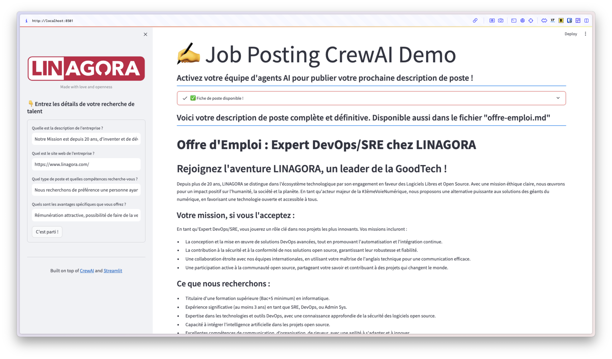

# Démo agents IA autonomes pour la création d'offres d'emploi
## Introduction
Ce projet est un exemple d'utilisation du framework CrewAI pour automatiser le processus d'élaboration d'une offre d'emploi. CrewAI orchestre des agents IA autonomes, leur permettant de collaborer et d'exécuter des tâches complexes de manière efficace.

Cette démonstration s'appuie sur les exemples du créateur de CrewAI [@joaomdmoura](https://x.com/joaomdmoura).

J'ai personnalisé les agents et les taches pour disposer d'un rendu en français faciliant la compréhension du fonctionnement des agents IA autonomes.

J'y ai aussi ajouté un frontend rapidement écrit avec le framework [Streamlit](https://streamlit.io/) pour rendre le tout plus visuel pour facilement l'utiliser dans le cadre de démonstration.

Au final, vous devriez obtenir cela :

<figure>
    
    <figcaption>L'application d'aide à la création d'offre d'emploi en action !</figcaption>
</figure>

# Concepts de CrewAI
CrewAI est conçu pour faciliter la collaboration d'agents d'IA jouant chacun un rôle. Les concepts clés de crewAI sont simples et peuvent se décrire en pseudo code :
- Agents
- Tasks
- Tools
- Processes

## Agents
Un **agent** dans CrewAI est une unité autonome programmée pour effectuer des tâches, prendre des décisions, et communiquer avec d'autres agents. Comparable à un membre d'une équipe humaine, chaque agent possède des compétences spécifiques et joue un rôle défini, contribuant ainsi à l'objectif commun de l'équipe. Les agents peuvent être impliqués dans diverses fonctions telles que la recherche, la rédaction, ou le support client, apportant chacun leur touche unique grâce à la diversité de leurs talents.

## Tasks
Les **tâches** dans le framework CrewAI sont des missions individuelles attribuées aux agents. Elles sont conçues pour encapsuler toutes les informations nécessaires à leur exécution, y compris une description, l'agent assigné, et les outils requis. Cette structuration offre une flexibilité dans la gestion des actions de divers niveaux de complexité et aide à coordonner les efforts des agents vers des objectifs partagés.

## Tools
Dans CrewAI, un **outil** est une compétence qu'un agent peut utiliser pour accomplir une tâche. Ces outils peuvent provenir de CrewAI Toolkit ou de LangChain Tools par exemple, et permettent aux agents d'effectuer des actions allant de recherches simples à des interactions complexes avec des systèmes externes. Ils offrent aux agents des capacités modulaires qu'ils peuvent mobiliser selon les besoins de leur mission. Un exemple est par exemple la capacité à aller rechercher des informations sur Internet.

## Processes
Les **processus** dans CrewAI jouent un rôle similaire à celui d'un chef de projet, en orchestrant la manière dont les tâches sont exécutées par les agents. Ils veillent à ce que les tâches soient attribuées et réalisées de manière optimale, en conformité avec un plan d'action stratégique. Les processus fournissent une vision d'ensemble et assurent la cohérence des activités des agents, favorisant ainsi une exécution efficace dans le respect des délais et des ressources.

## Collaboration entre les agents
La **collaboration** est essentielle entre les agents de CrewAI. Elle leur permet de combiner leurs compétences, de partager des informations et de se soutenir mutuellement dans l'accomplissement des tâches. Cette coopération incarne un véritable écosystème collaboratif où, à l'image d'une équipe humaine performante, les agents tirent leur force de leur capacité à travailler ensemble. Cette synergie collective permet d'atteindre des objectifs plus grands que la somme des contributions individuelles, ouvrant la voie à l'émergence d'une intelligence collective.

# Exécution du script ou de l'application
- **Configurer l'environnement** : Copiez le contenu `.env.example` dans un fichier `.env` et configurez les variables d'environnement pour OpenAI ou un modèle inféré en local. A l'heure actuelle, les meilleurs résultats dont obtenus avec les modèles d'OpenAI. Cela fonctionnement toutefois parfaitement avec les modèles servis par [Ollama](https://ollama.com/).
- **Installer les dépendances** : Exécutez `pip install -r requirements.txt`.

Deux possibilités s'offrent à vous pour mettre en opération les agents :
- **Exécuter le script en mode ligne de commande** : Lancez `python app.py`
- **Utiliser l'application Streamlit** : Lancez `streamlit run streamlit-app.py` puis rendez vous dans votre navigateur à l'URL `http://localhost:8501`

## Détails et explications
- Pour obtenir un bon résutlat, entrez les informations demandées lorsque vous y êtes invité de manière précise et concise. Le script s'appuiera sur la structure CrewAI pour créer l'offre d'emploi pour vous.

- **Composants clés** :
  - `./app.py` : fichier de script principal.
  - `./streamlit-app.py` : version adaptée du script principal pour l'intégrer dans l'application Streamlit

  - `./tasks.py` : Fichier principal avec les prompts de tâches.
  - `./agents.py` : Fichier principal avec la création des agents.
  - `./exemple-fiche-poste.md` : Exemple de description de poste dont CrewAI s'inspirera. Méthode du Few-shot prompting.

## Licence
Ce projet est publié sous la licence MIT.